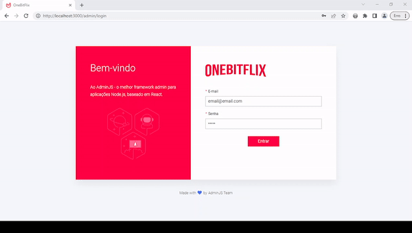
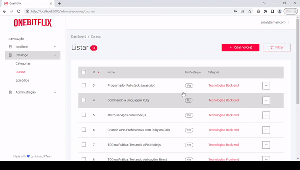
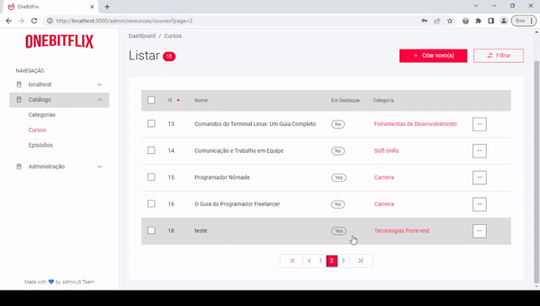
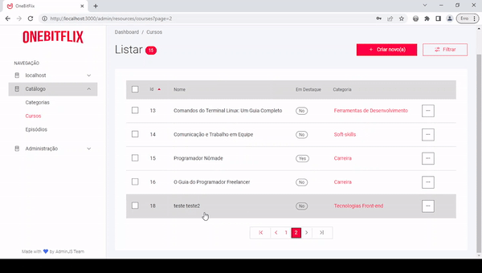
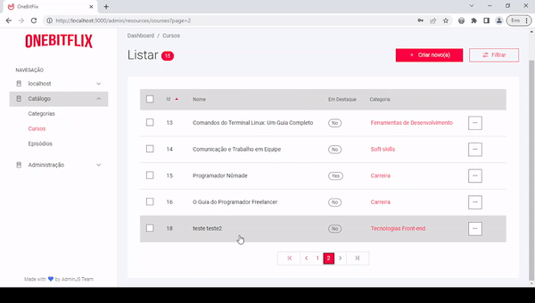

<h1 align="center">  </h1>

Este projeto foi feito em aula do curso da OneBitCode.  

  <a href="#-tecnologias">Tecnologias</a>&nbsp;&nbsp;&nbsp;|&nbsp;&nbsp;&nbsp;
  <a href="#-projeto">Projeto</a>

 

## 🤯 Demonstração

  

  

  

  

  

## 🚀 Tecnologias

Esse projeto foi desenvolvido com as seguintes tecnologias:

- node.js
- sequelize
- express
- postgreSQL
- admin.js
- bcrypt
- jsonwebtoken	
- cors	

## 💻 Projeto

Onebitflix é um projeto full-stack desenvolvido no curso da [OneBitCode](https://cursos.onebitcode.com/auth/cadastrar). Nele eu realizei o back-end de uma aplicação EAD de cursos inspirado no netflix

---

## 🤔 Instruções
### Primeiros passos:

Depois de baixar o arquivo no [GitHub](https://github.com/pdro-h0/onebitflix-back-end.git), no seu terminal, execute o seguinte comando na pasta raiz:

`npm install`

Após o primeiro passo, rode o comando no terminal para iniciar o projeto:

`npm run dev`

### Variáveis de Ambiente:

Para rodar esse projeto, você vai precisar adicionar as seguintes variáveis de ambiente no seu .env

`DATABASE_URL`

`ADMINJS_COOKIE_PASSWORD`

`JWT_KEY`

---

Feito com ♥ by Pedro Henrique